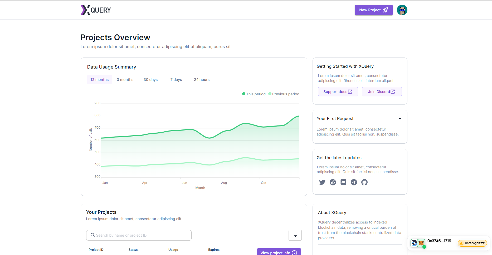

# Xquery dashboard

A repository to xquery end-user dashboard
For detailed documentation, head to [docs.blocknative.com](https://docs.blocknative.com)


<div align="center">
  
</div>

View live demo [here](https://xquery-v1.vercel.app/)!

## Getting started

Clone the repo:

```bash
git clone https://github.com/blocknetdx/xquery-enduser-dashboard.git
```

Navigate to the project directory:

```bash
cd xquery-enduser-dashboard
```

Install the dependencies:

```bash
yarn
```

Start the development server:

```bash
yarn start
```

The project will be running on [localhost:3000](http://localhost:3000)