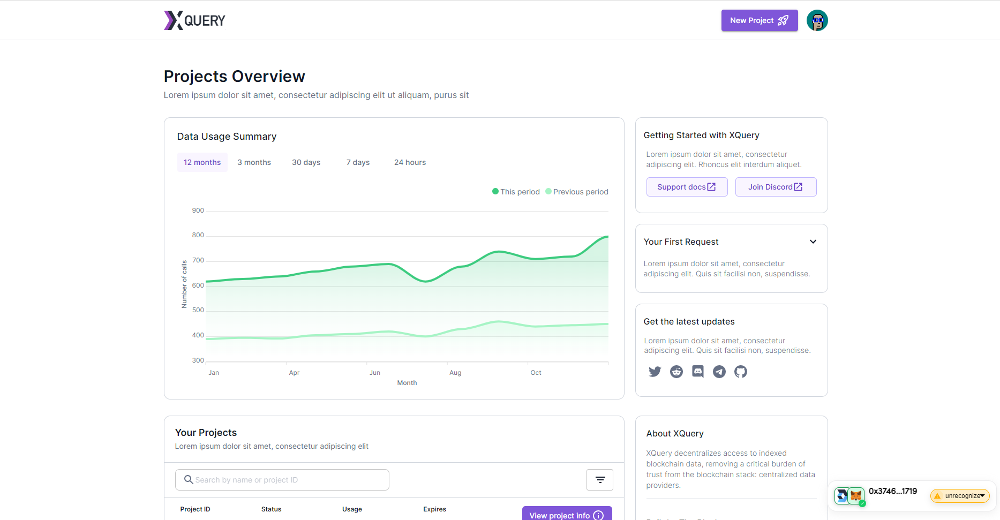

# Xquery dashboard

A repository for the XQuery web dashboard.

<div align="center">
  
</div>


## Getting started

Clone the repo:

```bash
git clone https://github.com/blocknetdx/xquery-enduser-dashboard.git
```

Navigate to the project directory:

```bash
cd xquery-enduser-dashboard
```

Install the dependencies:

```bash
yarn
```

Start the development server:

```bash
yarn start
```

The project will be running on [localhost:3000](http://localhost:3000)

To deploy to a server, first build the static files:

```bash
yarn run build
```

Copy the static files to the directory on the server and then run:
```bash
yarn start
```